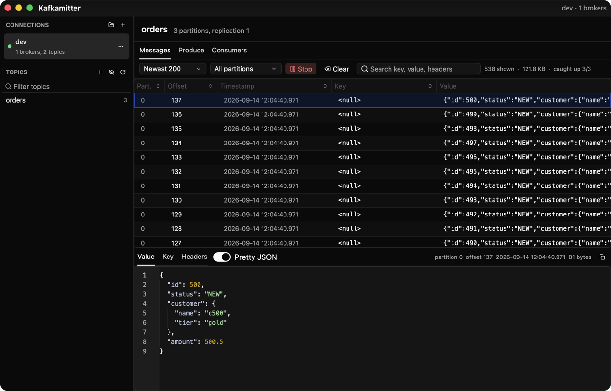
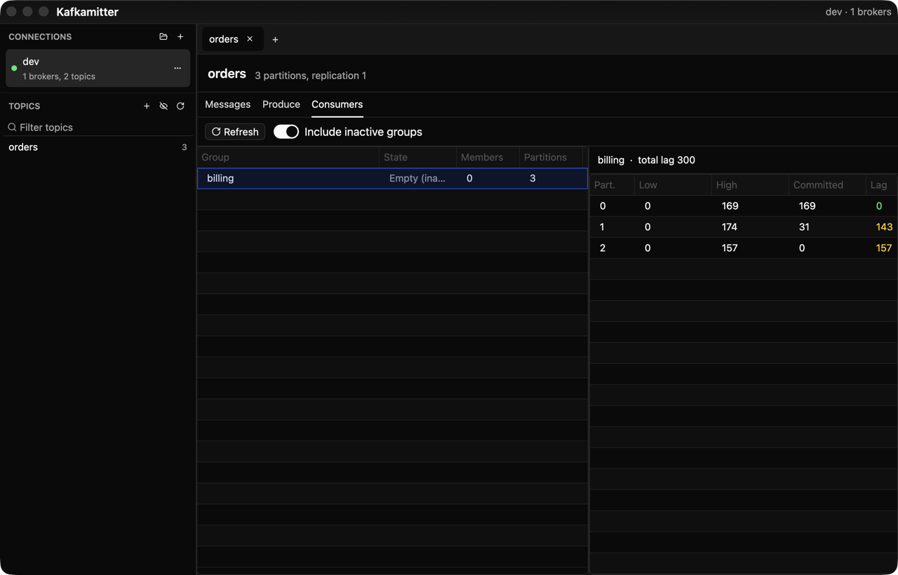

Kafkamitter is a native Kafka client for macOS. It is written in Rust with Zed's GPUI framework and librdkafka. The app starts in about 0.2 seconds, keeps memory bounded, and ships as one binary of 18 MB.

## Screenshots

Browse a topic, read its newest messages, and inspect one as pretty JSON.



Read the consumer groups of a topic, with the committed offset and the lag of every partition.



## Features

**Connections**

- Connect with PLAINTEXT or SASL_SSL. The SASL mechanisms are PLAIN, SCRAM-SHA-256, and SCRAM-SHA-512.
- Import a Kafka client properties file. The app reads a JKS truststore and converts it to PEM.
- Edit, rename, disconnect, or remove a connection from the menu button on each row.
- Each connection shows its state as a colored dot, with the broker and topic count.
- A connection that fails shows the broker error, a Retry button in the main area, and a reconnect button on its row. Reconnect also sits in the connection menu.

**Topics**

- Browse and filter the topics of a cluster. Show or hide internal topics.
- Create a topic with a partition count, a replication factor, and an optional retention.
- Delete a topic from its right-click menu. The app asks you to confirm.

**Messages**

- Select a topic and the newest 200 messages of each partition load at once. The newest message opens in the preview.
- Other start points: latest, beginning, a given offset, or a timestamp. You can limit the consumer to one partition.
- Search the messages. The term matches the value, the key, and the header names and values. The table then shows only the messages that hold it.
- Sort the table by any column. The first click sorts downward, the next click reverses it, and a third click returns to arrival order.
- Resize the columns and drag them into a different order.
- Inspect one message: value, key, and headers. Show the value as pretty JSON with the original key order and syntax colors. The preview colors JSON only. A header line or a value that is not JSON stays plain.
- Copy the value, the key, or the headers with one button.
- Select the text in the message table with the mouse and copy it with Cmd+C. The list holds its place while you drag.
- Right-click a message row to copy its value, its key, its headers, or the whole row.

**Produce**

- Send a message with a key, a value, headers, and an optional partition. The app reports the partition and the offset.

**Consumer groups**

- List the groups that consume the selected topic, with their members.
- For one group, show the committed offset, the low and high watermarks, and the lag for each partition.
- A flag marks a commit that fell behind the low watermark or that points past the high watermark.
- An optional scan finds groups that hold committed offsets but have no live member.

**Layout**

- Drag the divider between the sidebar and the main area, and the divider above the message preview.
- The app follows the light or dark appearance of macOS. Settings can pin it to light or dark instead.

## Key bindings

| Keys | Action |
| --- | --- |
| Cmd+T | New tab |
| Cmd+D | Duplicate the current tab |
| Cmd+W | Close the current tab |
| Cmd+Shift+W | Close every tab |
| Cmd+, | Open Settings |
| Cmd+1 to Cmd+9 | Switch to connection 1 to 9 |
| Cmd+Shift+] | Next connection |
| Cmd+Shift+[ | Previous connection |
| Cmd+E | Edit the active connection |
| Cmd+R | Consume the selected topic with the default start mode |
| Cmd+. | Stop the consumer |
| Cmd+Up | Select the first row of the table and open it |
| Cmd+Down | Select the last row of the table and open it |
| Cmd+F | Focus the message search box |
| Return | Focus the message value in the preview |
| Cmd+Q | Quit |

The Connection and Topic menus in the menu bar list the same actions. Cmd+Up and Cmd+Down move to the first and the last row of the table. They follow what you see, so a sort or a search term changes where they land. Return and the Cmd+arrow keys stay inactive while a text field or the topic list has focus.

## Settings

Cmd+, opens the settings dialog. The app saves the settings in `~/Library/Application Support/kafkamitter/settings.json`.

| Setting | Default | Effect |
| --- | --- | --- |
| Appearance | Follow the system | Use the light or dark setting of macOS, or pin the window to light or dark. The window changes as soon as you pick one. Cancel puts it back, Save keeps it. |
| Consume when a topic is selected | on | Start the consumer as soon as you select a topic. |
| Open the newest message after loading | on | Select and preview the newest message when every partition is caught up. |
| Show values as pretty JSON | on | The preview starts with the Pretty JSON switch on. |
| Newest messages per partition | 200 | How many messages the default start mode reads from each partition. |
| Maximum messages kept | 10 000 | The table drops the oldest message above this count. |
| Memory for messages, all tabs | 256 MB | The tabs share this budget. Each tab with a topic gets an equal part and drops its oldest messages above that part. |

## Tabs

Every tab is its own session. It keeps its connection, its topic, the sub-tab you were on, the messages it consumed, the search term, and the sort order. Switching between tabs loads nothing again, because each tab owns its views and its consumer keeps running in the background.

The tab strip sits above the topic header. Each tab carries a close cross, and a small `+` tab at the end opens another one. Right-click a tab for Duplicate tab, Close tab, and Close all tabs.

A new tab starts empty and asks you to select a connection from the left. Duplicating a tab copies the connection, the topic, and the sub-tab into a fresh session, which then loads its own messages. A window holds at most 13 tabs. Closing the last tab leaves one empty tab behind.

## What the app remembers per connection

Each connection keeps the topic you had open and the tab you were on. Switch to another connection and back, and the app returns you to the same place. The topic then loads its newest messages again. This memory lasts for the session and is not written to disk.

## Where the app stores credentials

The app keeps every connection, including the SASL password, in `~/Library/Application Support/kafkamitter/connections.json`. The app writes that file with permission `0600`, so only your account can read it. The password is in clear text, exactly as in a Kafka client properties file. Do not copy that file to a shared machine and do not commit it.

The app does not use the macOS Keychain, so it never asks for your login password. An older version stored passwords in the Keychain. On the first start, the app moves those passwords into the connections file and deletes the Keychain items. That migration asks for Keychain access once for each connection.

## Import a Kafka properties file

Kafkamitter reads the client properties files that the Kafka CLI, Offset Explorer, and Aiven use. It supports these keys:

- `bootstrap.servers`
- `security.protocol`, with the value `PLAINTEXT` or `SASL_SSL`
- `sasl.mechanism`
- `sasl.jaas.config`, or `sasl.username` and `sasl.password`
- `ssl.ca.location`, for a PEM file
- `ssl.truststore.location`, for a JKS file

The app converts a JKS truststore to a PEM file in `~/Library/Application Support/kafkamitter/ca/`. It ignores `ssl.keystore.location`, because SASL does not need a client certificate.

Two example files sit in `examples/`:

| File | Shows |
| --- | --- |
| `examples/plaintext.properties` | A local broker with no authentication. |
| `examples/sasl-ssl.properties` | A managed cluster with SCRAM over TLS and a Java truststore. Replace every value with your own. |

Try the first one against the local broker from `scripts/kafka-dev.sh`:

```sh
kafkamitter --check examples/plaintext.properties
```

In the app, the folder button next to Connections opens a file picker for the import.

## Command line

```sh
kafkamitter --check ~/kafka/staging.properties
```

`--check` reads the file, connects, and prints the broker, topic, and group count. It saves nothing.

```sh
kafkamitter --import ~/kafka/staging.properties
```

`--import` saves the file as a connection, with its password. A connection with the same name is replaced.

```sh
kafkamitter --version
```

`--version` prints one line, for example `Kafkamitter 0.2.1 (macos aarch64, librdkafka 2.12.1)`.

## Version

The Kafkamitter menu holds the item About Kafkamitter. It shows the app version, the platform, and the librdkafka version. The Copy version button puts the same line on the clipboard, which helps when you report a problem.

## Install

```sh
brew tap isdaniarf/tap
brew install --cask kafkamitter
```

Homebrew 6 asks you to trust a third-party tap once. Run `brew trust isdaniarf/tap` if it does.

The cask clears the macOS quarantine flag after it installs the app, so Gatekeeper does not block it. The app carries an ad-hoc signature and is not notarized.

Update with `brew upgrade --cask kafkamitter`. Remove the app and its settings with `brew uninstall --zap --cask kafkamitter`.

## Requirements

- macOS 13 or later on Apple Silicon or Intel.
- Rust stable 1.85 or later. The crate uses edition 2024.
- Xcode command line tools and cmake. The first build compiles librdkafka and OpenSSL from source, which takes several minutes.

The default build compiles the Metal shaders at runtime, so the Xcode Metal Toolchain is not needed. If you install that toolchain, build with `--no-default-features` to embed precompiled shaders instead.

## Build and run

```sh
cargo run --release
```

Create an app bundle in `dist.noindex/Kafkamitter.app`:

```sh
scripts/bundle.sh
```

The script signs the bundle with an ad-hoc signature. It does not notarize the app. The folder name ends in `.noindex`, so macOS keeps the development build out of Spotlight and Launchpad. Without that name, the build shows a second Kafkamitter icon next to the installed app, because both carry the same bundle identifier.

Rebuild the app icon after you change `assets/kafkamitter-icon.svg`:

```sh
scripts/make-icon.sh
```

It needs `rsvg-convert`, from `brew install librsvg`, and writes `assets/Kafkamitter.icns`.

Package a release archive for the Homebrew tap:

```sh
scripts/release.sh
```

It builds the bundle, writes `dist.noindex/Kafkamitter-<version>-<arch>.zip`, and prints the SHA-256 for the cask. Upload the archive to a release in `isdaniarf/homebrew-tap` and update `Casks/kafkamitter.rb` with the new version and hash.

## Local broker for development

The helper script uses the Homebrew Kafka installation in KRaft mode.

```sh
scripts/kafka-dev.sh start
scripts/kafka-dev.sh seed
scripts/kafka-dev.sh status
scripts/kafka-dev.sh stop
```

`seed` creates the topic `orders` with 500 JSON messages, and a consumer group `billing` that has read 200 of them.

## Tests

The unit tests run without a broker:

```sh
cargo test
```

They include window tests that open a GPUI window in memory, drag over a message
row, and check the text that the selection holds. The first test build compiles
GPUI a second time, because the test build needs the `test-support` feature.

The integration test in `tests/broker.rs` needs a broker. It creates a temporary topic, produces, consumes from the beginning and from the newest offsets, commits a consumer group, checks the offsets and the lag, and deletes the topic.

```sh
KAFKAMITTER_TEST_BOOTSTRAP=localhost:9092 cargo test --test broker -- --test-threads=1
```

## Developer options

These environment variables drive the app for measurements and automated checks.

| Variable | Effect |
| --- | --- |
| `KAFKAMITTER_TRACE_STARTUP=1` | Print elapsed milliseconds for startup, connection, consume, and view events to stderr. |
| `KAFKAMITTER_DEV_QUIET=1` | Do not bring the window to the front at startup. |
| `KAFKAMITTER_DEV_BOOTSTRAP=host:port` | Add a temporary PLAINTEXT connection named `dev` and connect at startup. The app does not save it. |
| `KAFKAMITTER_DEV_IMPORT=file.properties` | Import this file into memory only and connect at startup. The app does not save it. |
| `KAFKAMITTER_DEV_CONNECT=name` | Connect to the saved connection with this name at startup. |
| `KAFKAMITTER_DEV_TOPIC=name` | Select this topic after the connection succeeds. |
| `KAFKAMITTER_DEV_CONSUME=1` | Start the consumer with the default start mode. This applies only when the auto-consume setting is off. |
| `KAFKAMITTER_DEV_TAB=name` | Open the tab `messages`, `produce`, or `consumers` after the topic is selected. |
| `KAFKAMITTER_DEV_SELECT_GROUP=1` | Load the offsets of the first consumer group. |
| `KAFKAMITTER_DEV_PRODUCE=1` | Send one test message to the selected topic. |
| `KAFKAMITTER_DEV_SEARCH=term` | Put this term in the message search box after the topic is selected. |
| `KAFKAMITTER_DEV_RETRY=1` | Reconnect once after the first connection attempt, to exercise the retry path. |
| `KAFKAMITTER_DEV_TABTEST=mode` | Drive the tab actions once the topic loads. `new` opens a tab and stays on it, `switch` opens one and returns, anything else runs the whole lifecycle. |
| `KAFKAMITTER_DEV_JUMP=top` | Select the first or the last row once every partition is caught up. Accepts `top` or `bottom`. |
| `KAFKAMITTER_DEV_WINDOW=WxH` | Open the window at this size, to check the layout at a narrow width. |
| `KAFKAMITTER_DEV_EDIT=name` | Open the edit dialog for the saved connection with this name. |
| `KAFKAMITTER_DEV_SETTINGS=1` | Open the settings dialog at startup. |
| `KAFKAMITTER_DEV_RENAME=old=new` | Rename a saved connection through the dialog form code and save it. |
| `KAFKAMITTER_DEV_SWITCH=name` | Switch to this connection and back, to check that the app remembers the view. |
| `KAFKAMITTER_DEV_HEADERS=1` | Open the Headers tab of the preview after the newest message opens. |
| `KAFKAMITTER_DEV_DRAGTEST=1` | Drag across a message row in the real window and print the selected text with the scroll offset before and after. The window must be on screen. |
| `KAFKAMITTER_DEV_DRAG_Y=pixels` | Drag in this row instead of the first row that holds text. `KAFKAMITTER_DEV_DRAG_X0` and `KAFKAMITTER_DEV_DRAG_X1` set where the drag starts and ends. |

## Measurements

Measured on an Apple M-series Mac with the release build and the local Homebrew broker. The numbers come from `KAFKAMITTER_TRACE_STARTUP=1`.

| Metric | Value |
| --- | --- |
| Release binary | 18.4 MB |
| App bundle | 19 MB |
| Time to first render | 174 to 221 ms |
| Time to cluster metadata after process start | 254 to 358 ms |
| Consume 1 000 000 messages of 512 bytes | 2.9 to 11.9 s, so 85 000 to 350 000 messages per second |
| Resident memory during that consume | 112 to 120 MB, flat after the message cap |
| Apply a search term to a full table | 5 ms for 10 000 messages and 17 MB |

The consume time depends on how much of the topic the broker serves from its page cache. The slower figure is the steady state after several runs.

## Design notes

- The user interface runs on the main thread. Each connection owns one worker thread that holds the librdkafka clients. The interface sends a command and awaits a reply, so a slow broker never blocks the window.
- Each consume session owns one more thread. That thread polls the consumer and sends batches over a bounded channel. A full channel pauses the fetch, so the interface never falls behind.
- The message table keeps at most 10 000 messages or 256 MB. The oldest messages leave first. The table builds the preview text on the poll thread, so a cell never scans a message body.
- The message toolbar holds one row at every width. The controls keep their size, the search box takes the space that is left, and the status text shortens last.
- The search term matches bytes, so it never decodes a message. It folds ASCII letters, which makes it case-insensitive without an allocation. The table keeps one match flag for each message, tests only the new messages of each batch, and rebuilds the visible rows at most once for each frame.
- The message viewer never joins a consumer group and never commits an offset. It assigns partitions directly.
- The app reads the offsets of a group with a `ListConsumerGroupOffsets` request. The optional scan for inactive groups sends 32 of those requests at a time over one connection.
- Active consumer groups come from the group list and from the partition assignment of each member. The app decodes that assignment itself.

## Limits in this version

- No Schema Registry, and no Avro or Protobuf decoding.
- The app cannot reset or commit a consumer group offset.
- No mTLS client certificates and no Kerberos.
- The app does not convert a PKCS12 truststore. Export its CA to PEM and set `ssl.ca.location`.
- The consumer group list uses the classic group protocol. A group that uses the KIP-848 protocol appears through the inactive scan, without member details.
- The bundle carries an ad-hoc signature and is not notarized. Another Mac needs your approval to open it.
